# 练习9：设计并训练神经网络识别数字1~5
多分类函数为`function.multi_class()`，训练数据位于`data.py`中，
`recognition.py`为训练执行文件。

超参数：
- 训练轮数：1000
- 学习率：0.9
- 隐藏层节点数：50

训练后输出结果如下：
```
Predictions: 
Sample 1:
Input:
0 1 1 0 0
0 0 1 0 0
0 0 1 0 0
0 0 1 0 0
0 1 1 1 0
Prediction: 1
Raw softmax output:
['0.9999', '0.0000', '0.0000', '0.0001', '0.0000']
------------------------------
Sample 2:
Input:
1 1 1 1 0
0 0 0 0 1
0 1 1 1 0
1 0 0 0 0
1 1 1 1 1
Prediction: 2
Raw softmax output:
['0.0000', '0.9998', '0.0002', '0.0000', '0.0000']
------------------------------
Sample 3:
Input:
1 1 1 1 0
0 0 0 0 1
0 1 1 1 0
0 0 0 0 1
1 1 1 1 0
Prediction: 3
Raw softmax output:
['0.0000', '0.0002', '0.9996', '0.0000', '0.0002']
------------------------------
Sample 4:
Input:
0 0 0 1 0
0 0 1 1 0
0 1 0 1 0
1 1 1 1 1
0 0 0 1 0
Prediction: 4
Raw softmax output:
['0.0001', '0.0000', '0.0000', '0.9999', '0.0000']
------------------------------
Sample 5:
Input:
1 1 1 1 1
1 0 0 0 0
1 1 1 1 0
0 0 0 0 1
1 1 1 1 0
Prediction: 5
Raw softmax output:
['0.0000', '0.0000', '0.0002', '0.0000', '0.9998']
------------------------------
```
训练结果良好，训练集中所有数字识别结果均符合预期。

# 练习10：用训练数据训练网络，用测试数据测试训练结果
超参数与练习9中相同，仅更改测试数据。
由于随机数种子、超参数和输入数据均不变，实验发现多次运行的输出结果均一致。输出结果如下：
```
Predictions: 
Sample 1:
Input:
0 0 1 1 0
0 0 1 1 0
0 1 0 1 0
0 0 0 1 0
0 1 1 1 0
Prediction: 1
Raw softmax output:
['0.7714', '0.0392', '0.0070', '0.1797', '0.0026']
------------------------------
Sample 2:
Input:
1 1 1 1 0
0 0 0 0 1
0 1 1 1 0
1 0 0 0 1
1 1 1 1 1
Prediction: 2
Raw softmax output:
['0.0003', '0.8916', '0.1074', '0.0006', '0.0002']
------------------------------
Sample 3:
Input:
1 1 1 1 0
0 0 0 0 1
0 1 1 1 0
1 0 0 0 1
1 1 1 1 0
Prediction: 3
Raw softmax output:
['0.0003', '0.0244', '0.9744', '0.0005', '0.0004']
------------------------------
Sample 4:
Input:
0 1 1 1 0
0 1 0 0 0
0 1 1 1 0
0 0 0 1 0
0 1 1 1 0
Prediction: 1
Raw softmax output:
['0.6388', '0.2524', '0.0705', '0.0316', '0.0067']
------------------------------
Sample 5:
Input:
0 1 1 1 1
0 1 0 0 0
0 1 1 1 0
0 0 0 1 0
1 1 1 1 0
Prediction: 5
Raw softmax output:
['0.2929', '0.2132', '0.1341', '0.0214', '0.3384']
------------------------------
```
模型对样本4的预测结果为1，但期望结果为5，不符合预期。另外，模型对样本
5的预测结果虽为5，符合预期，但观察输出行向量中各个分类的权重可知，
对应预测值为5的权重仅为0.3384，与其他权重十分接近，预测效果一般。
由此可见，在训练集较小且简单的情况下，模型的泛化和抗噪声能力有限。

# 作业11：尝试构造其他测试数据测试网络
以下各个测试样本的预期输出均为1~5.
## 测试数据1
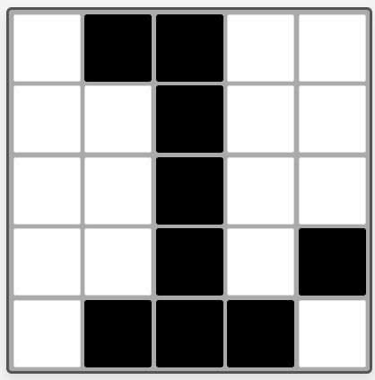
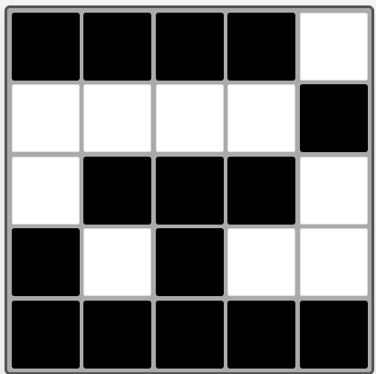
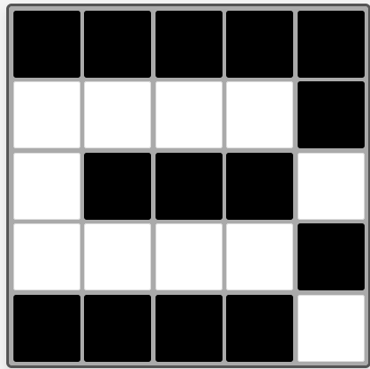
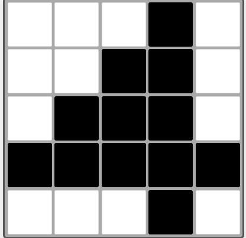
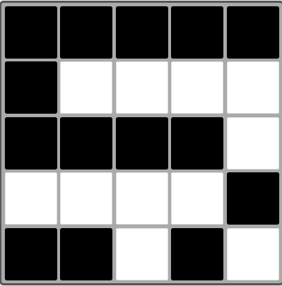

输出结果：
```
Predictions: 
Sample 1:
Input:
0 1 1 0 0
0 0 1 0 0
0 0 1 0 0
0 0 1 0 1
0 1 1 1 0
Prediction: 1
Raw softmax output:
['0.9991', '0.0000', '0.0001', '0.0008', '0.0000']
------------------------------
Sample 2:
Input:
1 1 1 1 0
0 0 0 0 1
0 1 1 1 0
1 0 1 0 0
1 1 1 1 1
Prediction: 2
Raw softmax output:
['0.0001', '0.9998', '0.0001', '0.0000', '0.0000']
------------------------------
Sample 3:
Input:
1 1 1 1 1
0 0 0 0 1
0 1 1 1 0
0 0 0 0 1
1 1 1 1 0
Prediction: 3
Raw softmax output:
['0.0001', '0.0001', '0.9971', '0.0001', '0.0027']
------------------------------
Sample 4:
Input:
0 0 0 1 0
0 0 1 1 0
0 1 1 1 0
1 1 1 1 1
0 0 0 1 0
Prediction: 4
Raw softmax output:
['0.0001', '0.0000', '0.0000', '0.9999', '0.0000']
------------------------------
Sample 5:
Input:
1 1 1 1 1
1 0 0 0 0
1 1 1 1 0
0 0 0 0 1
1 1 0 1 0
Prediction: 5
Raw softmax output:
['0.0000', '0.0000', '0.0002', '0.0000', '0.9998']
------------------------------
```
模型表现良好，各输出均符合预期。

## 测试数据2
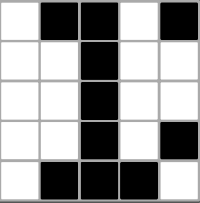
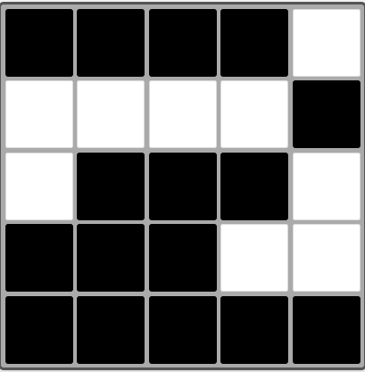
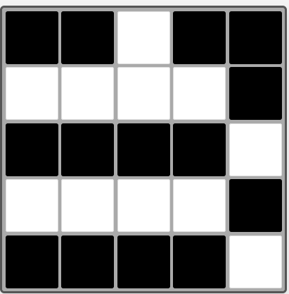
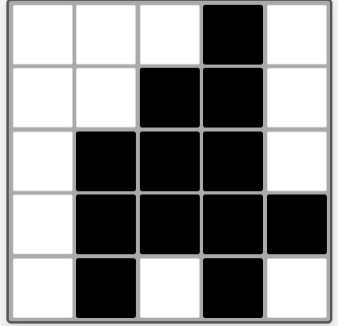
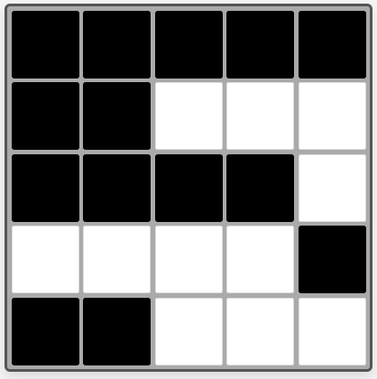

输出结果：
```
Predictions: 
Sample 1:
Input:
0 1 1 0 1
0 0 1 0 0
0 0 1 0 0
0 0 1 0 1
0 1 1 1 0
Prediction: 1
Raw softmax output:
['0.9987', '0.0000', '0.0001', '0.0009', '0.0003']
------------------------------
Sample 2:
Input:
1 1 1 1 0
0 0 0 0 1
0 1 1 1 0
1 1 1 0 0
1 1 1 1 1
Prediction: 2
Raw softmax output:
['0.0001', '0.9997', '0.0002', '0.0001', '0.0000']
------------------------------
Sample 3:
Input:
1 1 0 1 1
0 0 0 0 1
1 1 1 1 0
0 0 0 0 1
1 1 1 1 0
Prediction: 3
Raw softmax output:
['0.0001', '0.0001', '0.6623', '0.0007', '0.3368']
------------------------------
Sample 4:
Input:
0 0 0 1 0
0 0 1 1 0
0 1 1 1 0
0 1 1 1 1
0 1 0 1 0
Prediction: 4
Raw softmax output:
['0.0024', '0.0000', '0.0006', '0.9969', '0.0002']
------------------------------
Sample 5:
Input:
1 1 1 1 1
1 1 0 0 0
1 1 1 1 0
0 0 0 0 1
1 1 0 0 0
Prediction: 5
Raw softmax output:
['0.0000', '0.0000', '0.0000', '0.0000', '1.0000']
------------------------------

```
各输出均符合预期，模型表现良好，但模型认为样本3有33.68%的概率为5。

## 测试数据3
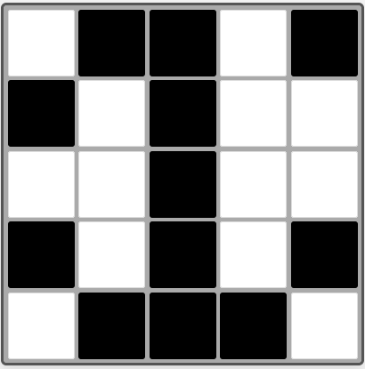
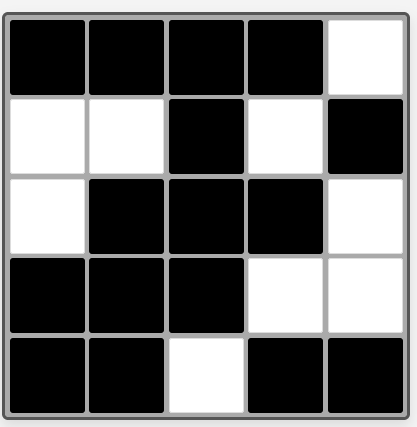
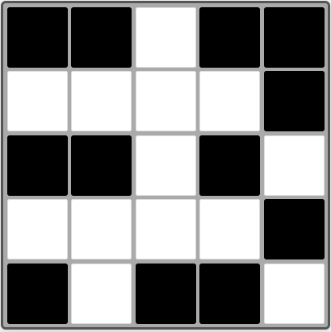
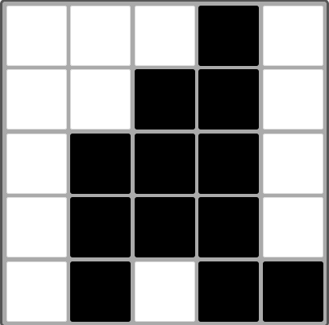
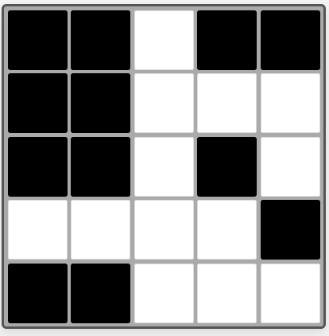

输出结果：
```
Predictions: 
Sample 1:
Input:
0 1 1 0 1
1 0 1 0 0
0 0 1 0 0
1 0 1 0 1
0 1 1 1 0
Prediction: 1
Raw softmax output:
['0.9969', '0.0001', '0.0000', '0.0021', '0.0010']
------------------------------
Sample 2:
Input:
1 1 1 1 0
0 0 1 0 1
0 1 1 1 0
1 1 1 0 0
1 1 0 1 1
Prediction: 2
Raw softmax output:
['0.0003', '0.9994', '0.0001', '0.0001', '0.0000']
------------------------------
Sample 3:
Input:
1 1 0 1 1
0 0 0 0 1
1 1 0 1 0
0 0 0 0 1
1 0 1 1 0
Prediction: 5
Raw softmax output:
['0.0000', '0.0000', '0.1112', '0.0003', '0.8885']
------------------------------
Sample 4:
Input:
0 0 0 1 0
0 0 1 1 0
0 1 1 1 0
0 1 1 1 0
0 1 0 1 1
Prediction: 4
Raw softmax output:
['0.0303', '0.0168', '0.0000', '0.9529', '0.0000']
------------------------------
Sample 5:
Input:
1 1 0 1 1
1 1 0 0 0
1 1 0 1 0
0 0 0 0 1
1 1 0 0 0
Prediction: 5
Raw softmax output:
['0.0000', '0.0000', '0.0000', '0.0000', '1.0000']
------------------------------
```
除对样本3的识别有误以外，模型在这组测试数据上的预测结果均正确，表现超出预期。