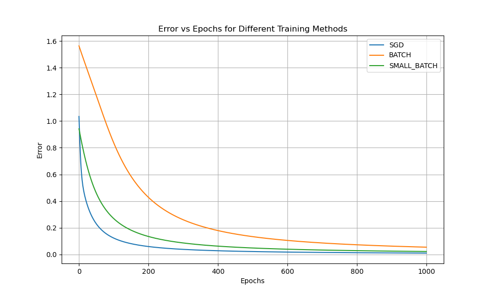

## 练习1结果记录

- 初始权重：创建一个numpy.random.default_rng实例，设置随机数种子为0并生成一个1x3的随机矩阵作为初始权重。
- 学习率：设置为0.3。
- 训练轮数：SGD为1000轮，Batch SGD为4000轮，Mini-Batch SGD为2000轮。

```
After training with SGD method:
Weights: [[ 5.93085677 -0.23594559 -2.73439359]]
input: [0 0 1] -> output: 0.0610 (desired: 0)
input: [0 1 1] -> output: 0.0488 (desired: 0)
input: [1 0 1] -> output: 0.9607 (desired: 1)
input: [1 1 1] -> output: 0.9508 (desired: 1)


After training with Batch SGD method:
Weights: [[ 5.92629088 -0.23652613 -2.73297373]]
input: [0 0 1] -> output: 0.0611 (desired: 0)
input: [0 1 1] -> output: 0.0488 (desired: 0)
input: [1 0 1] -> output: 0.9606 (desired: 1)
input: [1 1 1] -> output: 0.9506 (desired: 1)

After training with Mini-Batch SGD method:
Weights: [[ 5.93016321 -0.23662793 -2.73422676]]
input: [0 0 1] -> output: 0.0610 (desired: 0)
input: [0 1 1] -> output: 0.0488 (desired: 0)
input: [1 0 1] -> output: 0.9607 (desired: 1)
input: [1 1 1] -> output: 0.9507 (desired: 1)
```
## 练习2结果记录


## 练习3结果记录

### 第一组尝试：
- 轮数：4000轮
- 学习率：0.3

```
After training with SGD method:
Weights: [[-0.07640453 -0.03820227  0.03820227]]
input: [0 0 1] -> output: 0.5095 (desired: 0)
input: [0 1 1] -> output: 0.5000 (desired: 1)
input: [1 0 1] -> output: 0.4905 (desired: 1)
input: [1 1 1] -> output: 0.4809 (desired: 0)
```

### 第二组尝试：
- 轮数：40000轮
- 学习率：0.3

```
After training with SGD method:
Weights: [[-0.07640453 -0.03820227  0.03820227]]
input: [0 0 1] -> output: 0.5095 (desired: 0)
input: [0 1 1] -> output: 0.5000 (desired: 1)
input: [1 0 1] -> output: 0.4905 (desired: 1)
input: [1 1 1] -> output: 0.4809 (desired: 0)
```

### 第三组尝试：
- 轮数：40000轮
- 学习率：0.9
```
After training with SGD method:
Weights: [[-0.23750569 -0.11875285  0.11875285]]
input: [0 0 1] -> output: 0.5297 (desired: 0)
input: [0 1 1] -> output: 0.5000 (desired: 1)
input: [1 0 1] -> output: 0.4703 (desired: 1)
input: [1 1 1] -> output: 0.4409 (desired: 0)
```

### 第四组尝试：
- 轮数：4000轮
- 学习率：0.9

```
After training with SGD method:
Weights: [[-0.23750569 -0.11875285  0.11875285]]
input: [0 0 1] -> output: 0.5297 (desired: 0)
input: [0 1 1] -> output: 0.5000 (desired: 1)
input: [1 0 1] -> output: 0.4703 (desired: 1)
input: [1 1 1] -> output: 0.4409 (desired: 0)
```

### 第五组尝试：
- 轮数：1000轮
- 学习率：0.9
```
After training with SGD method:
Weights: [[-0.23750569 -0.11875285  0.11875285]]
input: [0 0 1] -> output: 0.5297 (desired: 0)
input: [0 1 1] -> output: 0.5000 (desired: 1)
input: [1 0 1] -> output: 0.4703 (desired: 1)
input: [1 1 1] -> output: 0.4409 (desired: 0)
```

### 第六组尝试：
- 轮数：100轮
- 学习率：0.9
```
After training with SGD method: 
Weights: [[-0.21825848 -0.10799828  0.09985884]]
input: [0 0 1] -> output: 0.5249 (desired: 0)
input: [0 1 1] -> output: 0.4980 (desired: 1)
input: [1 0 1] -> output: 0.4704 (desired: 1)
input: [1 1 1] -> output: 0.4436 (desired: 0)
```
### 猜想
所有输出都接近0.5，疑似训练无效。
通过调整训练轮数和学习率，观察到训练轮数大于1000时，训练结果不再受轮数影响。